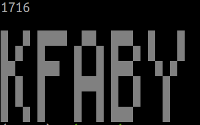

# Day 8

https://adventofcode.com/2019/day/8

Cute little exercise.

After reading in the input I split it into equal chunks (_image layers_) of
the given size (`width * height`).

Part 1 is about finding the layer with fewest 0 digits. For that I used the
built-in `min` function, and passed in a function that counts the 0 digits 
in a layer as the `key` parameter (`min` compares the keys of the items).

Part 2 is about creating the image from the layers. For this I pre-filled a 
list with transparent pixels in the size of the image. For each pixel I iterated
through all the layers for that pixel and stored the _first_ non-transparent pixel
into the result image (and stopped looking into deeper layers). 

For printing the result image, I split the list that represents the image into
rows and print each row. It was hard to see the letters among 1 and 0 digits,
so for black (0) pixels I printed a space character, and for white pixels I
printed a Unicode box drawing character. (See https://en.wikipedia.org/wiki/Box-drawing_character)

Result:

