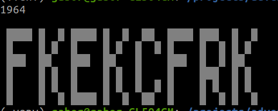

# Day 11

https://adventofcode.com/2019/day/11

The latest implementation of Intcode computer from day 9 was really helpful. It's abstraction of 
input reader and output writer was useful for reading colors from a _PaintBoard_ and writing colors
to the same board. The `PaintBoardReaderWriter` class implemented the reader and writer "interfaces",
maintained the state of the board and the painting robot's position and direction.

This works for now, but I probably would separate this into a `PaintBoard` (dealing with colors of
the grid) and a `PaintBoardReaderWriter` (delegating color stuff to `PaintBoard` and maintaining
robot position and direction). 

Result:

